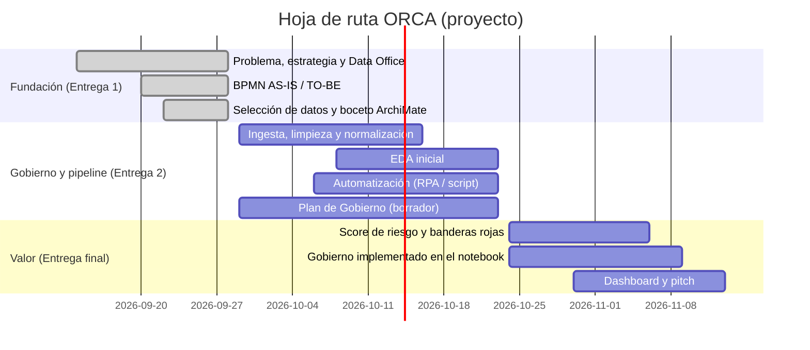
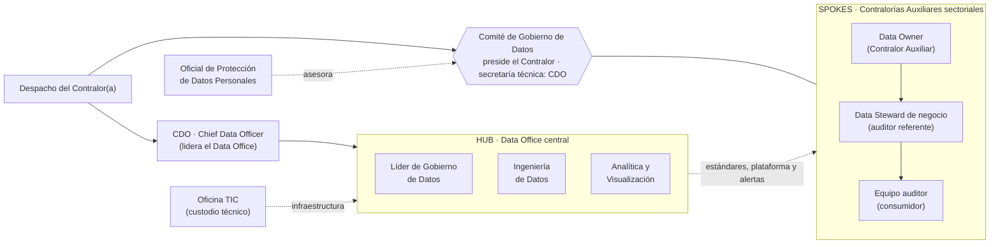

# 01 · Problema, estrategia y diseño del Data Office

| | |
|---|---|
| **Solución** | ORCA — Observatorio de Riesgo en Contratación de Antioquia |
| **Versión** | 1.0 (Entrega 1) · 28 de septiembre de 2026 |
| **Asignatura** | Data Office Strategy · UPB · Docente: María Victoria Valencia Arango |
| **Criterio de rúbrica** | 1. Problema, estrategia y diseño organizacional (10 %) |

> **Nota sobre el caso.** El caso es un escenario académico: una contraloría territorial (inspirada en la Contraloría General de Antioquia) que crea un Data Office. **Todas las cifras vienen de datos abiertos reales**, consultados el 27-sep-2026 con la API de datos.gov.co y reproducibles en [`notebooks/00_perfilamiento_fuente.ipynb`](../notebooks/00_perfilamiento_fuente.ipynb). Los procesos internos de la entidad (AS-IS) son una reconstrucción razonada a partir de la normativa de control fiscal. No son información interna de ninguna entidad.

---

## 1. Contexto

Las contralorías vigilan cómo las entidades públicas gastan los recursos. La mayor parte de ese gasto pasa por la **contratación pública**, que desde 2019 se publica casi en su totalidad en **SECOP II** y se expone como dato abierto, con actualización diaria, en datos.gov.co.

El dato existe, es público y está fresco. Lo que falta es la **capacidad organizacional** para convertirlo en decisiones de vigilancia. Esa capacidad es la que construye un Data Office.

## 2. El problema, medido

**Entidades con sede en Antioquia, contratos firmados entre el 1-ene-2024 y el 27-sep-2026 (SECOP II):**

| Indicador | Valor | Lectura |
|---|---:|---|
| Contratos firmados | **302.507** | ≈ 110.000 contratos por año: nadie puede revisarlos uno a uno |
| Valor total contratado | **$56,4 billones COP** | — |
| Entidades contratantes | **565** | — |
| Proveedores distintos | **83.932** | — |
| Contratos por **contratación directa** | **85,5 %** | La modalidad con menor competencia es la regla, no la excepción |
| Contratos con **personas naturales** (cédula) | **81,5 %** | El dataset está lleno de datos personales (PII) |
| Contratos del **orden territorial** | 187.059 (61,8 %), con el 81,3 % del valor | Es el universo de vigilancia de una contraloría territorial |

**Señal de riesgo encontrada en los datos: el efecto "Ley de Garantías".** La Ley 996 de 2005 restringe la contratación directa en los cuatro meses previos a la elección presidencial (primera vuelta: 31-may-2026):

| Mes | Contratos firmados | % contratación directa |
|---|---:|---:|
| dic-2025 | 3.883 | 40,9 % |
| **ene-2026** | **49.906** | **93,8 %** |
| feb-2026 | 1.382 | 14,4 % |
| mar-2026 | 1.741 | 11,5 % |
| abr-2026 | 1.403 | 15,4 % |
| may-2026 | 1.391 | 10,8 % |
| jul-2026 | 16.169 | 89,1 % |

En **un solo mes** se firmó el 16 % de todo lo contratado en casi tres años. Firmar en bloque justo antes de una restricción legal no es ilegal por sí mismo. Sí es un patrón que la literatura de integridad en compras públicas (Open Contracting Partnership, *Red Flags for Integrity*) trata como **bandera roja de planeación**: vale la pena vigilar esos contratos primero. Hoy la contraloría no tiene cómo detectarlo de forma sistemática.

**La calidad del dato también es parte del problema** (detalle en [02](02_seleccion_datos_abiertos.md)): 40.638 contratos de Antioquia sin fecha de firma, 20.706 con ciudad "No Definido", 2.848 con valor $0, campos de datos personales rellenos con textos como "No definido" o "Sin Descripcion" (nulos disfrazados) y nombres de entidad inconsistentes (p. ej. `MUNICIPIO DE ENVIGADO*`). Si se analizan tal cual, las conclusiones serán erróneas.

### Planteamiento del problema

> La contraloría selecciona qué contratos vigilar **por criterio histórico y juicio experto**, sobre extracciones manuales del SECOP que no se validan, no se trazan y copian datos personales sin control. Con ≈ 110.000 contratos al año en Antioquia y 85,5 % adjudicados sin competencia, **la cobertura es baja, la selección no es explicable y los patrones de riesgo (como el pico pre-Ley de Garantías) pasan inadvertidos**.

## 3. Necesidad de negocio

> **Pasar de una vigilancia fiscal reactiva y por muestreo a una priorización continua basada en riesgo, sobre datos confiables, trazables y que protejan a los titulares de datos personales.**

**Preguntas de negocio que ORCA debe responder** (guían el EDA de la entrega 2 y el dashboard de la final):

| # | Pregunta | Decisión que habilita |
|---|---|---|
| P1 | ¿Qué entidades concentran contratación directa por encima de su comportamiento histórico? | Incluir la entidad en el Plan de Vigilancia (PVCF) |
| P2 | ¿Qué contratos se firmaron en ventanas atípicas (pre-Ley de Garantías, fin de vigencia)? | Priorizar revisión documental |
| P3 | ¿Qué proveedores concentran contratos o valor en una misma entidad? | Auditoría de cumplimiento al par entidad–proveedor |
| P4 | ¿Qué personas naturales tienen contratos simultáneos con varias entidades? | Verificar capacidad real de ejecución |
| P5 | ¿Qué contratos tienen valores atípicos para su tipo y modalidad? | Revisión de estudios de mercado |
| P6 | ¿Qué procesos "competitivos" tuvieron un único oferente? | Alerta temprana por posible direccionamiento |

## 4. Objetivos (SMART, horizonte del proyecto)

| # | Objetivo | Meta medible | Fecha |
|---|---|---|---|
| O1 | Automatizar la ingesta de SECOP II | 100 % de los contratos de Antioquia desde 2024 cargados por API, con linaje por lote | 23-oct-2026 |
| O2 | Medir la calidad del dato | 6 dimensiones medidas por lote en el notebook; umbral de publicación ≥ 95 % | 23-oct-2026 |
| O3 | Proteger los datos personales | 0 campos PII en claro en las capas de consumo (dashboard y data mart) | 13-nov-2026 |
| O4 | Priorizar por riesgo | Score de riesgo con ≥ 6 banderas rojas para el 100 % de los contratos del alcance | 13-nov-2026 |
| O5 | Institucionalizar el gobierno del dato | Plan de Gobierno de Datos con los 8 artefactos exigidos, aplicado al dataset | 13-nov-2026 |

## 5. Estrategia

### 5.1 Alineación estratégica

| Nivel | Contenido para ORCA |
|---|---|
| **Estrategia corporativa** (misional) | Control fiscal oportuno y preventivo, en línea con el Acto Legislativo 04 de 2019 y el Decreto 403 de 2020 (vigilancia y seguimiento permanente de los recursos públicos). |
| **Estrategia de negocio** (del área de vigilancia) | Mayor cobertura con la misma planta de auditores, priorizando por riesgo en lugar de muestrear. |
| **Estrategia funcional de datos** (el Data Office) | Tratar el dato de contratación como **activo gobernado**: una sola fuente confiable, trazable y segura que alimenta la priorización. Se apoya en la Política Nacional de Explotación de Datos (CONPES 3920 de 2018). |

### 5.2 Tipo de estrategia de datos: defensa primero, ataque sobre esa base

Se usa el marco de **Dallemule y Davenport (HBR, 2017), *What's your data strategy?***, que distingue una estrategia **defensiva** (cumplimiento, calidad, seguridad, una sola versión de la verdad) de una **ofensiva** (analítica que genera valor y decisiones).

| | Defensa | Ataque |
|---|---|---|
| **En ORCA** | Calidad medida por lote, seudonimización de PII (Ley 1581), linaje, control de acceso, catálogo | Score de riesgo, banderas rojas, alertas tempranas, dashboard de priorización |
| **Peso inicial** | **≈ 60 %** | ≈ 40 % |

**Por qué este balance:**

1. **Una contraloría no puede equivocarse con los datos.** Un hallazgo fiscal basado en un dato erróneo (un valor de $1,16 billones mal digitado, una fecha nula) se cae, y le cuesta credibilidad a la entidad. La calidad es condición de la analítica, no un complemento.
2. **El dataset está lleno de PII** (81,5 % de contratos con personas naturales, cédulas de supervisores y ordenadores del gasto). Que un dato sea público por transparencia (Ley 1712 de 2014) no autoriza cualquier tratamiento posterior (Ley 1581 de 2012, principio de finalidad). Tomar la defensa a la ligera expone a la entidad.
3. **El ataque produce el valor visible** (qué auditar primero) y es lo que justifica ante el Contralor la inversión en el Data Office. Sin ataque, la defensa se percibe como burocracia.

Con más madurez, la proporción se desplaza hacia el ataque: modelos predictivos y cruces con otras fuentes (ver §8).

### 5.3 DOFA

| **Fortalezas** | **Debilidades** |
|---|---|
| Fuente abierta, oficial, diaria y con API · Conocimiento experto de los auditores · Mandato legal claro | Procesos manuales en Excel · Dependencia de TIC para extracciones · Sin roles de datos definidos · Sin reglas de calidad |
| **Oportunidades** | **Amenazas** |
| CONPES 3920 y lineamientos de gobierno digital · Herramientas gratuitas (Python, GitHub, Power BI) · Patrones de riesgo detectables (Ley de Garantías) | Cambios de esquema en SECOP sin aviso · Riesgo legal por mal uso de PII · Resistencia cultural ("siempre se ha auditado así") · Falsos positivos que desgasten a los auditores |

### 5.4 Propuesta de valor por actor

| Actor | Hoy | Con ORCA |
|---|---|---|
| Contralor(a) | Plan de vigilancia difícil de justificar | Plan priorizado por riesgo, explicable y trazable |
| Auditor | Días buscando y depurando datos | Recibe alertas priorizadas con la evidencia enlazada |
| Ciudadanía | Ve resultados tardíos | Vigilancia más oportuna sobre el gasto de su municipio |
| Titulares de datos (contratistas) | Cédulas copiadas en archivos sueltos | Datos seudonimizados y con acceso controlado |

### 5.5 Principios del Data Office

1. **Calidad antes de publicar:** ningún lote llega al dashboard sin score de calidad (quality gate).
2. **Privacidad desde el diseño:** la PII se seudonimiza en la capa *curated*, antes de cualquier consumo.
3. **La máquina mide, la persona decide:** el score prioriza, pero cada actuación fiscal la decide un rol con nombre propio.
4. **Todo dato tiene dueño:** cada activo del catálogo tiene un Data Owner y un Data Steward.
5. **Trazable de extremo a extremo:** del registro en el dashboard se puede volver al lote, a la consulta SoQL y al contrato original en SECOP.

### 5.6 Hoja de ruta

### 5.7 Indicadores de éxito del Data Office

| KPI | Fórmula | Meta |
|---|---|---|
| Frescura | Horas entre el corte de SECOP y la publicación en el dashboard | ≤ 24 h |
| Calidad por lote | Score ponderado de las 6 dimensiones | ≥ 95 % |
| Cobertura de riesgo | Contratos con score / contratos del alcance | 100 % |
| Precisión de alertas | Alertas pertinentes / alertas gestionadas (lo registra el auditor) | ≥ 60 % en el primer trimestre |
| Protección de PII | Campos PII en claro en capas de consumo | 0 |
| Gobierno | Activos del catálogo con Owner y Steward asignados | 100 % |

---

## 6. Diseño organizacional del Data Office

### 6.1 ¿Qué modelo organizacional?

| Modelo | Ventaja | Desventaja para una contraloría |
|---|---|---|
| **Centralizado** (todo en una oficina de datos) | Estándares únicos, control fuerte | Cuello de botella; la oficina no conoce el negocio de cada sector auditado |
| **Descentralizado** (cada dirección hace lo suyo) | Cercanía al negocio | Diez versiones del mismo contrato, sin estándares ni control de PII: justo el AS-IS actual |
| **Híbrido / federado (hub & spoke)** ✅ | Estándares, plataforma y gobierno centrales; conocimiento de negocio distribuido | Exige coordinación (comité) y roles bien definidos |

**Decisión: modelo híbrido *hub & spoke*.**
- El **hub** (Data Office central) es dueño de lo que debe ser único: la plataforma, el pipeline, las reglas de calidad, la política de PII, el catálogo y el linaje.
- Los **spokes** (las Contralorías Auxiliares sectoriales: salud, educación, infraestructura, etc.) aportan lo que solo ellos saben: qué es riesgoso en su sector, si una alerta es pertinente, qué actuación procede.
- Así el Data Office **no se vuelve el dueño del negocio**: el dato es de quien responde por él (el Data Owner), y el Data Office pone las reglas y la plataforma.

### 6.2 ¿Dónde se ubica el CDO?

El **CDO reporta directamente al Despacho del Contralor(a)**, no a la Oficina TIC:

- El problema es de **decisión y gobierno** (qué vigilar, con qué dato, bajo qué reglas), no de infraestructura.
- Bajo TIC, el gobierno del dato se reduce a "administrar bases de datos" y pierde autoridad sobre los dueños del negocio.
- TIC sigue siendo clave como **custodio técnico** de la infraestructura y la seguridad.

### 6.3 Organigrama

### 6.4 Roles y responsabilidades

| Rol | Ubicación | Responsabilidades clave | Dominio DAMA-DMBOK |
|---|---|---|---|
| **CDO** | Hub, reporta al Despacho | Estrategia de datos, prioridades, presupuesto, rinde cuentas por el valor del Data Office | Gobierno de datos |
| **Comité de Gobierno de Datos** | Transversal | Aprueba políticas, umbrales de calidad y reglas de riesgo; resuelve conflictos entre direcciones | Gobierno de datos |
| **Líder de Gobierno de Datos** | Hub | Catálogo, diccionario, políticas, métricas de calidad, gestión de metadatos | Metadatos · Calidad |
| **Data Owner** | Spoke (Contralor Auxiliar) | Responde por el uso del dato en su sector; aprueba accesos; decide la actuación fiscal | Gobierno de datos · Seguridad |
| **Data Steward de negocio** | Spoke (auditor referente) | Define reglas de negocio y de riesgo del sector; revisa incidentes de calidad; recalibra con los falsos positivos | Calidad · Gobierno |
| **Ingeniero(a) de Datos** | Hub | Pipeline de ingesta, limpieza y normalización; linaje; automatización | Integración · Almacenamiento |
| **Analista / Científico(a) de Datos** | Hub | EDA, banderas rojas, score de riesgo, dashboard | BI · Analítica |
| **Custodio técnico (TIC)** | Oficina TIC | Infraestructura, copias de seguridad, gestión de identidades y accesos | Seguridad · Operaciones |
| **Oficial de Protección de Datos Personales** | Asesor del Comité | Verifica cumplimiento de la Ley 1581 (finalidad, circulación restringida, seguridad) y aprueba la política de seudonimización | Seguridad |
| **Consumidor** (auditor) | Spoke | Usa alertas y tablero; registra si la alerta fue pertinente | — |

### 6.5 RACI preliminar (se completa en el Plan de Gobierno, Entrega 2)

R = Responsable (ejecuta) · A = Aprueba (rinde cuentas) · C = Consultado · I = Informado

| Actividad | CDO | Comité | Líder Gob. | Owner | Steward | Ingeniería | Analítica | TIC | Oficial PD | Auditor |
|---|---|---|---|---|---|---|---|---|---|---|
| Definir la estrategia y las prioridades del Data Office | **A** | C | C | C | I | I | I | I | I | I |
| Aprobar políticas y estándares | C | **A** | R | C | C | I | I | C | C | I |
| Ingesta diaria desde la API | I | — | I | I | I | **A/R** | I | C | — | — |
| Definir las reglas de calidad | I | A | **R** | C | R | C | C | — | — | I |
| Resolver incidentes de calidad | I | — | C | I | **A/R** | R | I | — | — | — |
| Seudonimizar y clasificar la PII | I | A | C | C | I | **R** | I | C | **C** | — |
| Definir las banderas rojas de riesgo | I | A | C | C | **R** | C | R | — | — | C |
| Aprobar el acceso a datos del sector | I | — | C | **A** | C | I | I | R | C | I |
| Gestionar alertas de riesgo | — | — | — | I | I | — | I | — | — | **A/R** |
| Decidir la actuación fiscal | I | — | — | **A/R** | C | — | C | — | — | C |

### 6.6 Forma de trabajo: agilidad dentro de la estructura

La **estructura** es funcional e híbrida (quién responde por qué). La **ejecución** es ágil:

- **Célula ORCA** (squad multidisciplinario): Product Owner (delegado del Data Owner), Líder de Gobierno, Ingeniero(a) de Datos, Analista y un Data Steward de negocio rotativo.
- **Scrum con sprints de 2 semanas**, alineados a las entregas: Sprint 1 (fundación), Sprints 2–3 (pipeline y gobierno), Sprints 4–5 (riesgo y dashboard).
- **Backlog** en GitHub Projects/Issues: cada historia de usuario se enlaza a su commit, y así el propio repositorio sirve como evidencia de trazabilidad.
- **Definición de "terminado"** que incluye gobierno: una historia no se cierra si el activo que produce no está en el catálogo con Owner, Steward y clasificación.

### 6.7 Roles del equipo del proyecto

| Integrante | Rol en ORCA | Entregables que lidera |
|---|---|---|
| Luis Ángel Seoanes Ovieso | CDO / Arquitecto(a) de datos · Product Owner | Estrategia, ArchiMate, integración y README |
| *Integrante 2* | Líder de Gobierno de Datos · Data Steward | Plan de Gobierno, reglas de calidad, clasificación y RACI |
| *Integrante 3* | Ingeniero(a) de Datos · Analista | Pipeline Python, EDA, automatización y dashboard |

Los tres integrantes hacen commits en todos los componentes. Los roles indican quién lidera cada frente, no quién lo hace solo.

### 6.8 Madurez

| Dimensión | Hoy (AS-IS) | Meta con ORCA |
|---|---|---|
| Gobierno | Nivel 1 · Inicial: sin roles ni políticas | Nivel 3 · Definido: roles, políticas y comité operando |
| Calidad | Nivel 1: se corrige a mano cuando se nota | Nivel 3: reglas medidas por lote con umbral |
| Metadatos y linaje | Nivel 1: no existen | Nivel 3: catálogo y linaje por lote |
| Analítica | Nivel 1–2: consultas ad hoc | Nivel 3: score de riesgo y tablero recurrente |

## 7. Riesgos y supuestos

| Riesgo / supuesto | Mitigación |
|---|---|
| SECOP cambia columnas o nombres sin aviso | Validación de esquema en cada lote (regla de *validez*); el lote falla de forma controlada y se registra en el linaje |
| La API pública es lenta o se cae | Reintentos con espera (backoff), ingesta incremental y límites de página (ver el BPMN TO-BE) |
| Las banderas rojas generan falsos positivos | Retroalimentación del auditor → el Steward recalibra (mejora M6 del BPMN) |
| Uso indebido de la PII | Seudonimización en *curated*, acceso por rol y aprobación del Oficial de Protección de Datos |
| **Supuesto:** el alcance de vigilancia son las entidades del orden territorial de Antioquia | La lista oficial de sujetos de control, que excluye municipios con contraloría propia, se incorporará como **dato maestro** en la entrega 2 |

## 8. Evolución con mayor madurez

1. Cruces con otras fuentes abiertas (sanciones y multas, RUES, presupuesto territorial) para enriquecer el riesgo.
2. Pasar de reglas a **modelos** (detección de anomalías), entrenados con los falsos positivos etiquetados.
3. Publicar indicadores agregados (sin PII) para la ciudadanía como dato abierto de segunda generación.

## Referencias

- Dallemule, L. y Davenport, T. (2017). *What's your data strategy?* Harvard Business Review, 95(3).
- DAMA International (2017). *DAMA-DMBOK: Data Management Body of Knowledge* (2.ª ed.).
- Open Contracting Partnership (2016). *Red Flags for Integrity: Giving the green light to open data solutions.*
- Congreso de Colombia: Ley 1581 de 2012 (protección de datos personales); Ley 1712 de 2014 (transparencia); Ley 996 de 2005 (Ley de Garantías); Acto Legislativo 04 de 2019.
- Presidencia de la República: Decreto 403 de 2020 (control fiscal).
- DNP (2018). CONPES 3920: Política Nacional de Explotación de Datos (Big Data).
- Colombia Compra Eficiente. *SECOP II – Contratos Electrónicos* (jbjy-vk9h), datos.gov.co.
