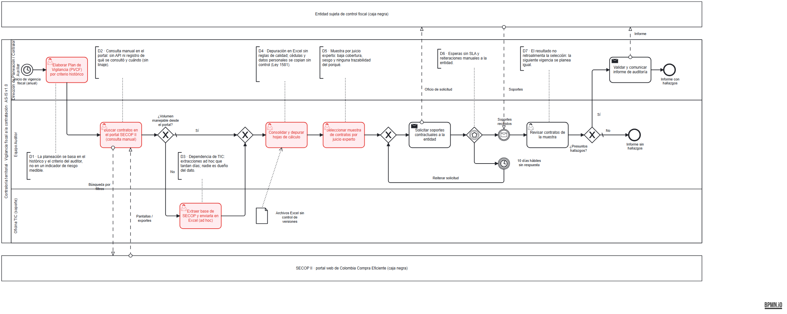
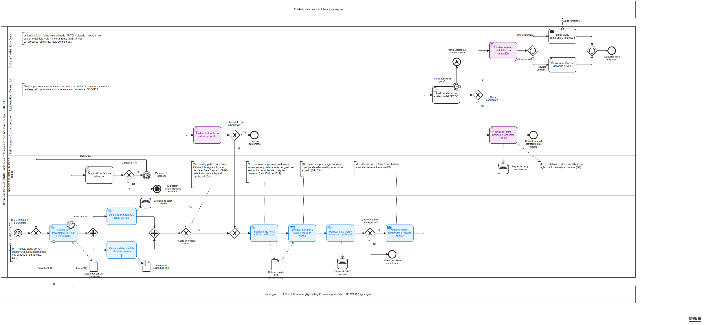
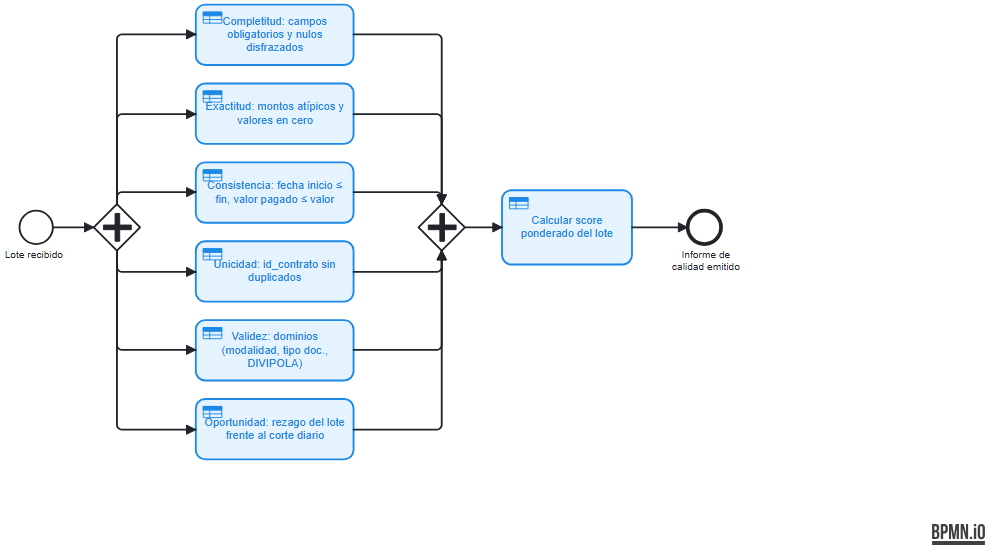

# 03 · Procesos (BPMN 2.0)

| | |
|---|---|
| **Proceso** | Vigilancia fiscal a la contratación pública |
| **Código / versión** | ORCA-PR-001 · AS-IS v1.0 y TO-BE v1.0 · 28-sep-2026 |
| **Archivos fuente** | [`bpmn/ORCA-AS-IS-v1.0.bpmn`](bpmn/ORCA-AS-IS-v1.0.bpmn) · [`bpmn/ORCA-TO-BE-v1.0.bpmn`](bpmn/ORCA-TO-BE-v1.0.bpmn) |
| **Herramienta** | BPMN 2.0 XML estándar con diagrama (DI). Se abre en [demo.bpmn.io](https://demo.bpmn.io), Camunda Modeler o draw.io. Validado con bpmn-js: 0 advertencias |
| **Criterio de rúbrica** | 2. Procesos (BPMN) con mejoras identificadas (10 %) |

---

## 1. AS-IS: cómo se selecciona hoy qué contratos vigilar

**Participantes.** Un pool con carriles (la contraloría) y dos pools de **caja negra**: la entidad sujeta de control y el portal SECOP II. Se modelan como caja negra porque la contraloría no controla su comportamiento interno; solo intercambia mensajes con ellos.

| Carril | Rol |
|---|---|
| Dirección de Planeación / Contralor Auxiliar | Planea la vigencia y valida el informe |
| Equipo Auditor | Busca, depura, selecciona y revisa |
| Oficina TIC (soporte) | Extrae bases cuando el volumen supera lo que el portal permite consultar |

**Recorrido.** Un temporizador anual (inicio de vigencia) dispara la elaboración del Plan de Vigilancia (PVCF) por criterio histórico. El auditor busca contratos manualmente en el portal. Si el volumen no es manejable, le pide una extracción a TIC, que envía archivos Excel sin control de versiones. El auditor consolida y depura a mano, elige una muestra por juicio experto y pide soportes a la entidad. Una **compuerta basada en eventos** espera la respuesta (mensaje) o el vencimiento de 10 días hábiles, y en ese caso se reitera la solicitud. Finalmente revisa la muestra y, si hay presuntos hallazgos, se valida y comunica el informe.

### Dolores identificados (en rojo en el diagrama)

| # | Dolor | Tipo de desperdicio | Impacto en el dato |
|---|---|---|---|
| **D1** | Planeación por histórico y criterio, no por riesgo medible | Decisión sin evidencia | La selección no se puede explicar ni auditar |
| **D2** | Búsqueda manual en el portal, sin API | Tiempo, reproceso | Sin linaje: nadie sabe qué se consultó ni cuándo |
| **D3** | Dependencia de TIC para extracciones ad hoc | Espera | Nadie es dueño del dato; versiones distintas del mismo contrato |
| **D4** | Depuración en Excel sin reglas de calidad | Reproceso, error | Calidad no medida; PII copiada sin control (riesgo Ley 1581) |
| **D5** | Muestra por juicio experto | Baja cobertura | Sesgo; patrones como el pico pre-Ley de Garantías pasan inadvertidos |
| **D6** | Esperas sin SLA y reiteraciones manuales | Espera | Actuaciones tardías: el dinero ya se gastó |
| **D7** | El resultado no retroalimenta la selección | Aprendizaje perdido | La siguiente vigencia se planea igual |

## 2. TO-BE: ORCA, priorización de la vigilancia basada en riesgo

**Sub-proceso "Validar calidad del lote (6 dimensiones)"** (colapsado en el diagrama principal; en el modelador se abre con doble clic):

### 2.1 Carriles: cada tarea vive en el carril de quien la ejecuta

| Carril | Rol del Data Office (ver doc. 01) | Qué hace en el proceso |
|---|---|---|
| Contralor Auxiliar · **Data Owner** | Rinde cuentas por el dato y por la decisión | Prioriza el sujeto y decide la actuación fiscal |
| Equipo Auditor · **Consumidor** | Usa el dato | Analiza alertas y dice si son pertinentes |
| **Data Steward** · Gobierno del dato | Custodia de negocio | Decide sobre los lotes con baja calidad; recalibra las reglas con los falsos positivos |
| Ingeniería de Datos · **Custodio técnico** | Opera el pipeline | Diagnostica fallos de extracción |
| **Plataforma ORCA [AUTO]** | Automatización | Todo lo determinista y repetible |

Aislar la plataforma en su propio carril deja ver de un vistazo que **la mayor parte del proceso ya no es trabajo humano**. Los carriles humanos quedan casi vacíos a la izquierda porque las personas solo intervienen **por excepción**.

### 2.2 Recorrido normal

1. **Temporizador diario (02:00)** → extracción del lote desde la API SODA (tarea de servicio). La interacción con datos.gov.co se modela con **flujos de mensaje** (consulta SoQL → lote JSON).
2. **Compuerta paralela (AND):** en paralelo y de forma **obligatoria**, se registran los metadatos y el linaje del lote (se escribe en el almacén *Catálogo de datos y linaje*) y se valida la calidad (sub-proceso). Con un XOR se podría perder el linaje, y con un OR la trazabilidad sería opcional. El AND de unión exige que ambas ramas terminen.
3. **Quality gate (XOR):** con un score ≥ 95 %, el lote sigue solo. Con menos, lo revisa el Data Steward.
4. **Seudonimizar PII y aplicar clasificación** → objeto de datos *Dataset curado (PII seudonimizada)*, que entra a:
5. **Calcular banderas rojas y score de riesgo** (tarea de **regla de negocio**: aplica reglas versionadas, no es un servicio genérico).
6. **Publicar el data mart y refrescar el dashboard** → almacén *Data mart ORCA*.
7. **¿Hay contratos con riesgo alto?** No → fin *Monitoreo diario completado*. Sí → **tarea de envío**: notificar alertas priorizadas al auditor (el candidato a automatizar con Power Automate en la entrega 2).
8. El auditor **analiza la alerta** con la evidencia enlazada al SECOP. Si es pertinente, el Data Owner **prioriza y define la actuación**. Una **compuerta inclusiva (OR)** permite emitir una alerta temprana a la entidad, incluirla en el PVCF, **o ambas**; por defecto, se incluye en el PVCF. El OR de unión espera solo las ramas activadas.

### 2.3 Excepciones y SLA: tres mecanismos, deliberadamente distintos

| Situación | Mecanismo BPMN | Comportamiento |
|---|---|---|
| **Falla técnica** (API caída o esquema cambiado) | **Evento de error adjunto (interruptor)** a la extracción | Ingeniería diagnostica. Si quedan intentos (< 3), un **temporizador intermedio de 1 h** (backoff) devuelve el token a la **compuerta de convergencia** anterior a la extracción. Agotados los intentos → **fin de terminación** (cancela toda la instancia; ningún token queda colgado). |
| **Calidad insuficiente** (score < 95 %) | Compuerta XOR (**no** un evento de error: es un incumplimiento de contrato, no una falla de sistema) | El Steward decide si libera el lote con advertencia o lo deja **en cuarentena**. El flujo por defecto es la revisión: ante la duda, no se publica. |
| **Inacción humana** (alerta sin gestión) | **Temporizador adjunto no interruptor (P3D)** en "Analizar alerta" | A los 3 días hábiles se lanza un **evento de fin de escalamiento** al Contralor Auxiliar, **sin cancelar** la tarea del auditor. |

### 2.4 Estados finales

| # | Estado final | Carril | Significado |
|---|---|---|---|
| F1 | Monitoreo diario completado | Plataforma | Lote procesado, sin riesgos altos |
| F2 | Actuación fiscal programada | Data Owner | Éxito: alerta convertida en actuación |
| F3 | Alerta descartada (retroalimenta el modelo) | Steward | Falso positivo registrado para recalibrar las reglas |
| F4 | Lote en cuarentena | Steward | El dato no se publica |
| F5 | Extracción fallida: incidente escalado | Ingeniería | **Terminación**: fallo no recuperable |
| F6 | Alerta escalada al Contralor Auxiliar | Data Owner | **Escalamiento** por SLA vencido |

## 3. Mejoras: del AS-IS al TO-BE

| Mejora | Resuelve | Qué cambia | Indicador |
|---|---|---|---|
| **M1** Ingesta diaria automatizada por API | D2, D3 | Temporizador + tarea de servicio; linaje por lote | Frescura ≤ 24 h; 0 extracciones manuales |
| **M2** Quality gate con gestión por excepción | D4 | Sub-proceso de 6 dimensiones + umbral del 95 %; el Steward solo ve los lotes que fallan | Score de calidad por lote; % de lotes en cuarentena |
| **M3** Seudonimización y clasificación de PII | D4 | La PII se transforma antes de cualquier consumo (Ley 1581) | 0 PII en claro en las capas de consumo |
| **M4** Selección por riesgo | D1, D5 | Banderas rojas ponderadas reemplazan el juicio experto como primer filtro | 100 % de cobertura con score |
| **M5** Alertas con SLA y escalamiento | D6 | Notificación automática + temporizador P3D | % de alertas gestionadas dentro del SLA |
| **M6** Ciclo de retroalimentación | D7 | Los falsos positivos recalibran las reglas versionadas | Precisión de alertas (pertinentes / gestionadas) |

**Frontera manual / automático.** Se automatiza lo **determinista, repetible y sin juicio de valor**: extraer, registrar el linaje, medir la calidad, seudonimizar, calcular el score, publicar y notificar. Queda humano lo que exige **criterio o rendición de cuentas**: liberar un lote defectuoso, decidir si una alerta es pertinente y elegir la actuación fiscal. **La máquina mide, la persona decide.**

**Candidatos para la automatización de la entrega 2** (criterio 3 de la rúbrica):
1. Ingesta programada (script de Python + Programador de tareas de Windows o GitHub Actions): tareas M1 y T1.
2. Notificación de alertas por correo con Power Automate, leyendo el data mart: tarea M5 "Notificar alertas".

## 4. Notación utilizada

| Elemento | Dónde |
|---|---|
| Pools de caja negra + flujos de mensaje | Entidad sujeta de control; SECOP II / datos.gov.co |
| Carriles (5 en el TO-BE, 3 en el AS-IS) | Un carril por rol |
| Eventos de inicio temporizados | Anual (AS-IS) y diario (TO-BE) |
| Tareas de usuario, servicio, regla de negocio y envío | Según quién o qué ejecuta la tarea |
| Sub-proceso con su propio plano | Validar calidad del lote |
| Compuertas XOR (con flujo por defecto), AND, OR y basada en eventos | Decisiones, paralelismo obligatorio, actuaciones combinables, espera de respuesta |
| Evento de error adjunto (interruptor) | Fallo de la API |
| Temporizador adjunto **no interruptor** | SLA de la alerta |
| Temporizadores intermedios | Backoff de 1 h; 10 días hábiles (AS-IS) |
| Evento de mensaje intermedio | Soportes recibidos (AS-IS) |
| Fin de terminación y fin de escalamiento | Fallo no recuperable; SLA vencido |
| Objetos de datos y almacenes de datos | Lote crudo, informe de calidad, dataset curado; catálogo, data mart, reglas versionadas |
| Anotaciones | Dolores D1–D7 y mejoras M1–M6 |
| Color | Rojo = dolor (AS-IS) · Azul = automatizado · Morado = decisión de gobierno |
