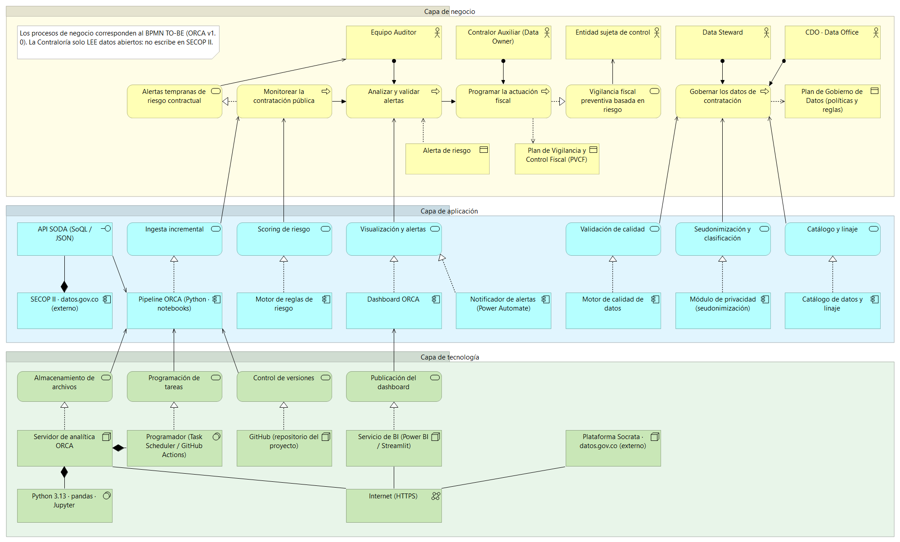
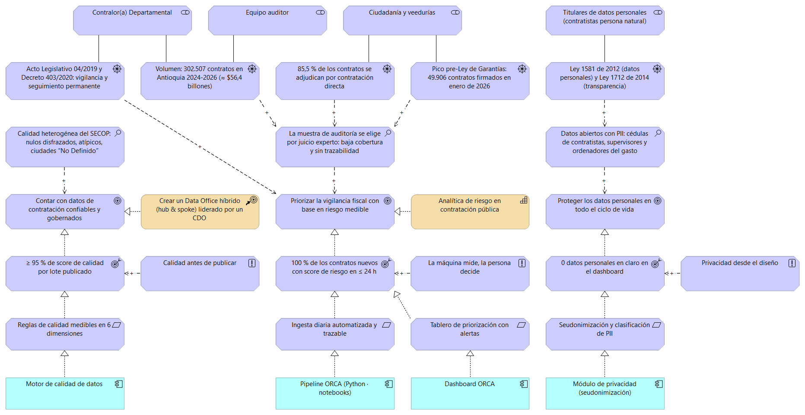
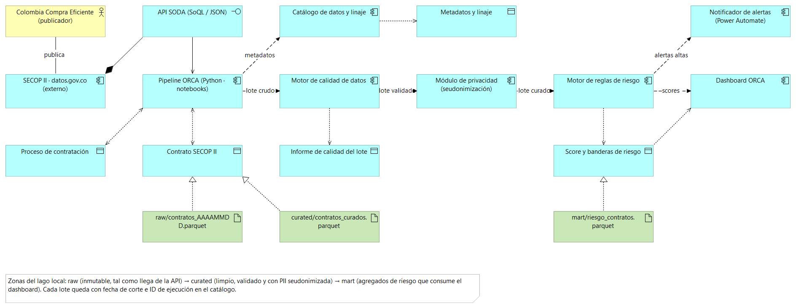

# 04 · Arquitectura de la solución (ArchiMate) · Boceto

| | |
|---|---|
| **Modelo** | [`archimate/ORCA-Arquitectura-v0.1.archimate`](archimate/ORCA-Arquitectura-v0.1.archimate) (formato nativo de **Archi**) |
| **Versión** | v0.1, boceto de la Entrega 1 · 28-sep-2026 |
| **Contenido** | 77 elementos · 95 relaciones · 3 vistas |
| **Validación** | Todas las relaciones se verificaron contra la tabla oficial de relaciones permitidas de Archi 5.10 (ArchiMate 3.2). Las imágenes se exportaron con Archi. |
| **Criterio de rúbrica** | 4. Arquitectura de datos: modelo de las 3 capas coherente y justificado (10 %) |

---

## Vista 01 · Por capas (negocio · aplicación · tecnología)

**Capa de negocio.** Los procesos son los mismos del BPMN TO-BE, con el mismo lenguaje: *Monitorear la contratación → Analizar y validar alertas → Programar la actuación fiscal* (relaciones de *disparo*), más el proceso de apoyo *Gobernar los datos de contratación*, asignado al Data Steward y al CDO. Cada actor se asigna al proceso que ejecuta, igual que los carriles del BPMN. El proceso de monitoreo realiza el servicio *Alertas tempranas*, que sirve al auditor. La actuación fiscal realiza la *Vigilancia fiscal preventiva*, que sirve a la entidad sujeta de control.

**Capa de aplicación.** Cada servicio de aplicación lo realiza un componente con una sola responsabilidad:

| Componente | Servicio que realiza | Proceso de negocio al que sirve |
|---|---|---|
| Pipeline ORCA (Python) | Ingesta incremental | Monitorear |
| Motor de reglas de riesgo | Scoring de riesgo | Monitorear |
| Dashboard ORCA + Notificador (Power Automate) | Visualización y alertas | Analizar alertas |
| Motor de calidad | Validación de calidad | Gobernar datos |
| Módulo de privacidad | Seudonimización y clasificación | Gobernar datos |
| Catálogo de datos y linaje | Catálogo y linaje | Gobernar datos |

SECOP II / datos.gov.co aparece como **componente externo** que expone la **interfaz API SODA**. La contraloría **consume** datos de SECOP y **nunca escribe** en él.

**Capa de tecnología.** Un *Servidor de analítica ORCA* (Python 3.13, pandas, Jupyter y un programador de tareas) realiza el almacenamiento de archivos (Parquet por zonas) y la programación de tareas. GitHub realiza el control de versiones y un servicio de BI (Power BI o Streamlit) publica el dashboard. Todo se conecta por Internet (HTTPS) a la plataforma Socrata de datos.gov.co.

## Vista 02 · Motivación y estrategia

Esta vista es la **trazabilidad del porqué**: une cada decisión de arquitectura con la estrategia del documento 01.

- **Drivers medidos en los datos, no supuestos:** 302.507 contratos, 85,5 % por contratación directa, el pico de 49.906 contratos en enero de 2026 y el marco normativo.
- **Evaluaciones** → **metas** → **resultados** medibles (≥ 95 % de calidad, 0 PII en claro, 100 % de los contratos con score en ≤ 24 h).
- Los **principios** (calidad antes de publicar, privacidad desde el diseño, la máquina mide y la persona decide) influyen en los resultados.
- Los **requisitos** los realizan componentes concretos de la capa de aplicación. Así, cada componente de la vista 01 existe porque responde a un requisito.
- **Estrategia:** el curso de acción *Crear un Data Office híbrido (hub & spoke)* realiza la meta de datos gobernados. La capacidad *Analítica de riesgo en contratación* realiza la meta de priorizar por riesgo.

## Vista 03 · Flujo de información (boceto de linaje)

Esta vista es el primer boceto del **linaje** exigido por el gobierno de datos (fuente → transformación → dataset → dashboard). Las relaciones de *flujo* etiquetadas muestran el lote atravesando pipeline → calidad → privacidad → reglas de riesgo → dashboard y notificador. Cada objeto de datos está realizado por un artefacto físico de su zona (*raw*, *curated*, *mart*). En la entrega 2 se completa con el catálogo y el linaje a nivel de campo.

---

## Decisiones de arquitectura (justificación)

| # | Decisión | Alternativa descartada | Por qué |
|---|---|---|---|
| AD-1 | Ingesta por **API SODA** con ventana móvil y hash por registro | Descargar el CSV completo (6 M de filas) cada día | Solo se trae el alcance (Antioquia). La marca de agua `:updated_at` no sirve porque el publicador reescribe todo a diario (ver doc. 02). |
| AD-2 | **Almacenamiento en Parquet por zonas** (raw → curated → mart) | Una única tabla o archivos Excel | Zonas = linaje y control de acceso por nivel de sensibilidad. *raw* es inmutable (evidencia legal). Parquet es columnar, tipado y comprimido. |
| AD-3 | **Módulo de privacidad separado** del pipeline | Seudonimizar "donde toque" dentro del notebook | Un único punto de control para la PII, fácil de auditar por el Oficial de Protección de Datos |
| AD-4 | **Motor de reglas de riesgo con reglas versionadas** | Umbrales fijos dentro del código | El Steward recalibra sin reescribir el pipeline (mejora M6); cada score queda asociado a la versión de las reglas |
| AD-5 | **Local + GitHub**, sin nube | AWS/Azure/GCP | La nube es opcional en el curso y no agrega valor para un volumen de ≈ 300 mil filas. La arquitectura queda preparada: las zonas se mapean 1:1 a un lago de datos en la nube si se escala. |
| AD-6 | **Notificador en Power Automate** | Correo desde Python | Es la herramienta de automatización vista en el curso y lo que usaría una entidad pública con Microsoft 365 |

## Pendiente para las siguientes entregas

- **Entrega 2:** vista de linaje a nivel de campo, vista de seguridad y control de acceso (quién accede a cada zona) y un artefacto real por cada zona.
- **Entrega final:** vista de despliegue definitiva y alineación con el dashboard implementado.

## Cómo abrir el modelo

1. Descargar **Archi** (gratuito): <https://www.archimatetool.com/download/>
2. *File → Open* → `documentacion/archimate/ORCA-Arquitectura-v0.1.archimate`
3. Las 3 vistas están en la carpeta *Views*. Cada elemento tiene documentación en la pestaña *Properties*.
